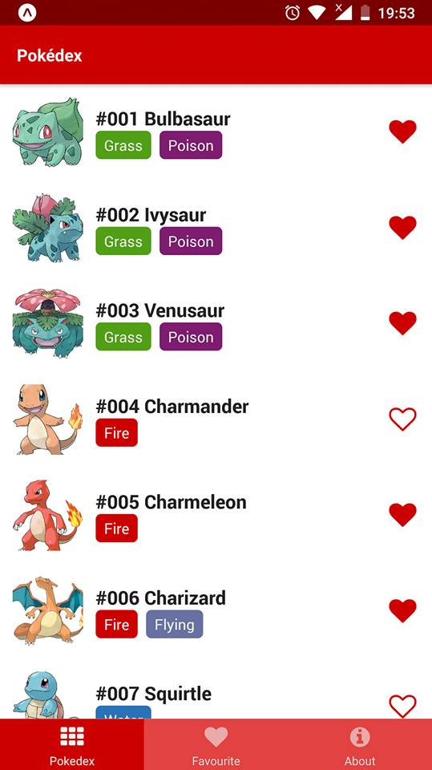

## React Native Pokedex App

Simple Pokedex app written using React Native.

## Getting Started

To start the app run the following commands:

```
npm install expo-cli --global
npm install
npm start
```

## App


